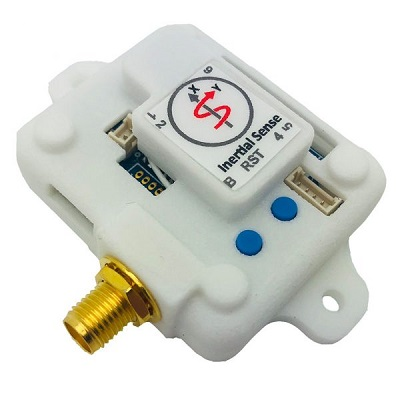

# EVB-1

The Inertial Sense EVB1.x is a development board which contains the Inertial Sense µINS, µAHRS, or µIMU module. The EVB1.x functions as a breakout and communications board with the following features:

- Access to all communications pins on the module
- USB connection, either directly to the module or through an on-board FTDI chip
- Integrated RS232 / RS485 transceiver

## LICENSE

Use these Hardware Design files as you wish.  Inertial Sense is not liable for any claim, damages, or other liability resulting from their use.  See the included *LICENSE* file for details.

------

## Support

Email - support@inertialsense.com

------

(c) 2014-2022 Inertial Sense, Inc.
