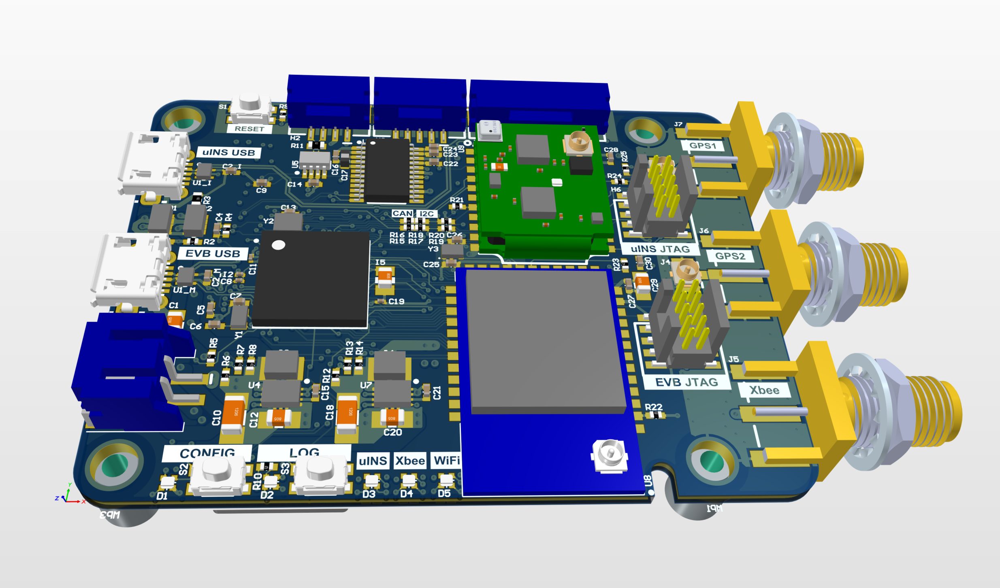

# EVB-2 Evaluation Board

The Inertial Sense [EVB-2](https://docs.inertialsense.com/user-manual/hardware/EVB2/) is a development board which contains the Inertial Sense µINS, µAHRS, or µIMU module. The EVB-2 builds on the foundation established by the EVB-1, but adds these and other new features:

- 915MHz Xbee radio for RTK (real-time-kinematics)
- Wi-Fi and Bluetooth Low energy (BLE) for remote data viewing and logging operation
- Onboard logging to micro SD card.
- Dual antenna ports for GPS compassing
- Companion Microchip SAME70 processor that serves as a communication bridge between the µINS, µAHRS, or µIMU and all other interfaces.

The EVB-2 PCB assembly design files are provided in Altium Designer format.

------

## LICENSE

Use these Hardware Design files as you wish.  Inertial Sense is not liable for any claim, damages, or other liability resulting from their use.  See the included *LICENSE* file for details.

------

## Revision Info

### r2.1.2

+ Move TIOA1 (TC input) pin from GPIO1 to GPIO9 for measuring encoder velocity on to GPIO9 (multi-tie).  We would not like to have to tie GPIO9 and GPIO3 together offboard the EVB-2 for wheel encoder input.  We share the QDEC and TC input on the same line for angle and velocity measurement.

+ Consider adding a TC input to each of the QDEC channel A lines so all wheel encoder inputs support velocity measurement.
+ Add second CAN transceiver from EVB E70 to H2 and remove CAN jumper.  We can share H2 with uINS and EVB-E70.  Connect transceivers disable line to jumper or EVB disable line.
+ Enlarge fiducials from 0.76mm to 1.0mm on both sides.
+ Fix the I2C line (SDA, SCL) reversal on EVB-2 SAME70.

________________________________________________________________________________

### r2.1.0

+ Dual purpose reset line to reset uINS and MCU using an RC filters.  One resets
  quickly and the other follows after a delay.
+ Consider loading ICE debugger header for SAME70 MCU by default to support
  developers.
+ Expose uINS data ready pin GPIO13 on H7.
+ Fix top layer copper pour for XBee regulator input that connects C20 pin 2 to
  XBee regulator U7 pin 1.
+ Cut trace (disconnect) VUSB from ESD protection for both USB ports.  It's
  causing voltage to appear on FET switches and partially enable.
+ Add EVB version number to PCB
+ Consider switching battery to Seiko MS621T for -40 to 85 C temp range.
+ Add jumper selection of CAN transceiver to uINS and EVB processor for CAN
  support.
+ Consider exposing SAME70 chip erase (PB12) to SMT resistor pads to 3.3V.
+ Fix reversed uINS CAN Rx and Tx lines.  (Double check this).

________________________________________________________________________________

### r2.0.1

+ Add inverted bold labels for I/O headers.
+ Reverse the H1 power pin order so pin 1 is positive and pin 2 ground.
+ Add fiducials to help SMT machine alignment.
+ Invert and increase label size for I/O headers so they are easier to read.
+ Move to new button style
+ Fit shorter U.FL cables
+ Fix error that applied H1 voltage to the USB port in the power schematic
+ Remove or fix XBee USB power FET logic (Q3).
+ Remove R51 and connect with trace.
+ Fix RX line of XOR gate.
+ Add version label.
+ Update manufacturing docs for new U.FL cables (current cables are good)
+ Jumper to G1_SDA and G2_SCL to CAN transceiver to support future generation
  of uINS which will have new processor with CAN stack. 
+ Consider consolidating the power input FET arrays
+ Move INS reset from common reset to MCU pin.
+ Move voltage sensing circuit to analog capable pin of MCU instead of on INS.
+ Connect QDEC2 and QDEC4 lines to H8 so we can support 3 quadrature encoders.
+ Move to 0.0033uF caps on SS/TR lines on voltage regulators to bring rise time
  into spec.

------

## Support

Email - support@inertialsense.com

------

(c) 2014-2022 Inertial Sense, Inc.
