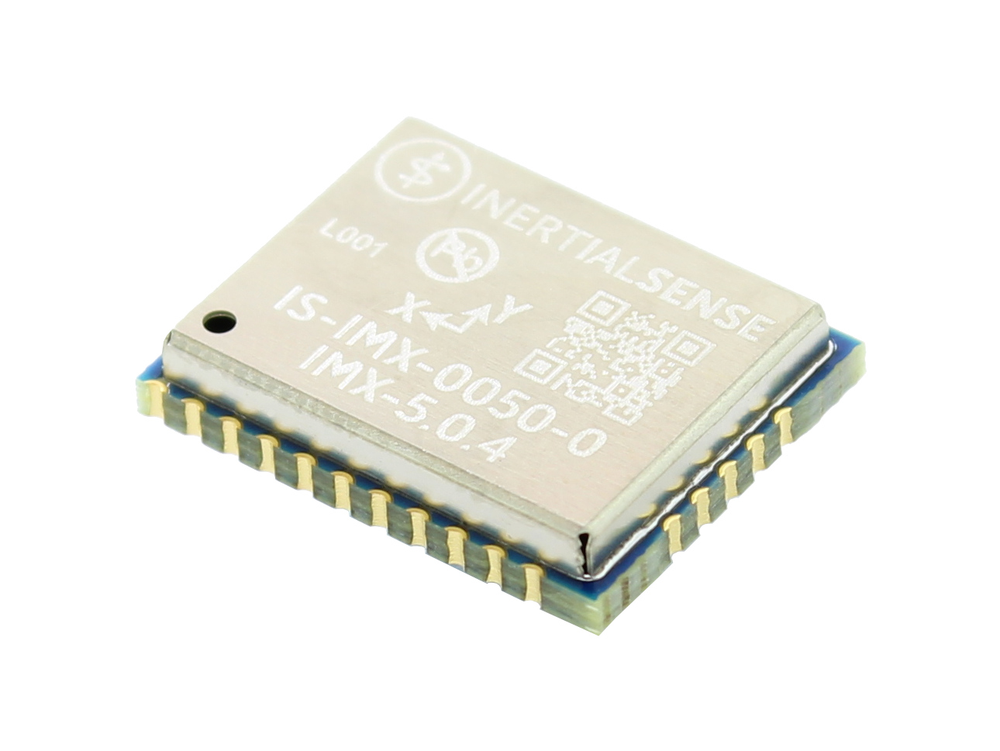

# IMX-5

The **IMX-5**™ is a 10-DOF sensor module consisting of a tactical grade Inertial Measurement Unit (IMU), magnetometer, and barometer. Output includes angular rate, linear acceleration, magnetic vector, and barometric pressure and altitude. IMU calibration consists of bias, scale factor, cross-axis alignment, and temperature compensation. The IMX-5 includes Attitude Heading Reference System (**AHRS**) sensor fusion to estimate roll, pitch, and heading. Adding GNSS input to the IMX-5 enables onboard Inertial Navigation System (**INS**) sensor fusion for roll, pitch, heading, velocity, and position.

## Features

- **Tactical Grade IMU**
  - **Gyro: 1.5 °/hr Bias Instability, 0.16 °/√hr ARW**
  - **Accel: 19 µg Bias Instability, 0.02 m/s/√hr VRW**
- **INS, AHRS**
  - **Dynamic: 0.04° Roll/Pitch, 0.13° Heading**
  - **Static: 0.1° Roll/Pitch, 0.5° Heading**
- **Surface Mount Reflowable (PCB Module)**
- Up to 1KHz IMU and INS Output Data Rate
- Small Form Factor:  15.6 x 12.5 x 2.9 mm
- Light Weight:  0.8 g
- Low power consumption:  <110mW
- External GNSS Support (Multi-Band)
- Attitude (Roll, Pitch, Yaw, Quaternions), Velocity, and Position UTC Time Synchronized
- Triple Redundant IMUs Calibrated for Bias, Scale Factor, Cross-axis Alignment, and G-sensitivity
- -40°C to 85°C Sensor Temperature Calibration
- Binary and NMEA ASCII Protocol
- Barometric Pressure and Humidity
- Strobe In/Out Data Sync (Camera Shutter Event) 
- Fast Integration with SDK and Example Software

## Applications

- Drone Navigation
- Unmanned Vehicle Payloads
- Ground and Aerial Survey
- Automotive Navigation
- Stabilized Platforms
- Antenna and Camera Pointing
- First Responder and Trackers
- Health, Fitness, and Sport Monitors
- Robotics and Ground Vehicles
- Maritime

## LICENSE

Use these Hardware Design files as you wish.  Inertial Sense is not liable for any claim, damages, or other liability resulting from their use.  See the included *LICENSE* file for details.

------

## Support

Email - support@inertialsense.com

------

(c) 2014-2022 Inertial Sense, Inc.
