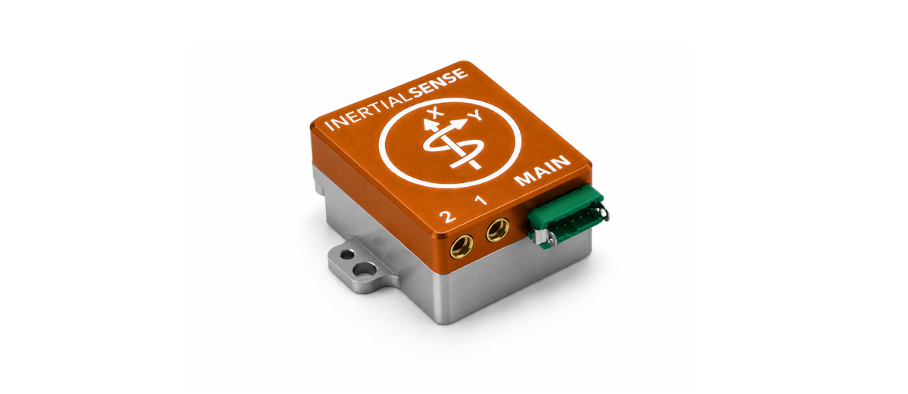

# RUG-4-Dual	(Rugged-4 Dual)

The **RUG-4-Dual** adds a rugged aluminum enclosure and RS232, RS485, and CAN bus to the **IMX-6**. The **RUG-4-RTK** includes a multi-frequency GNSS receiver with RTK precision position enabling INS sensor fusion for roll, pitch, heading, velocity, and position. The **RUG-4-Dual** includes two multi-frequency GNSS receivers with RTK precision position and dual GNSS heading/compass. 

## Features

- **Tactical Grade IMU**
  - **Gyro: 1.5 °/hr Bias Instability, 0.10 °/√hr ARW**
  - **Accel: 2.8 µg Bias Instability, 0.013 m/s/√hr VRW**
- **INS, AHRS**
  - **Dynamic: 0.03° Roll/Pitch, 0.09° Heading**
  - **Static: 0.1° Roll/Pitch, 0.5° Heading**
- Up to 1KHz IMU and INS Output Data Rate
- Dual onboard multi-band (L1/L2/E5) GNSS receivers
- Dual MMCX antenna ports for GPS compassing
- Size:  25.4 x 25.4 x 20.0 mm
- Light weight:  14g
- Low power consumption:  <1500mW
- UART x3, RS232, RS485, CAN, and SPI interfaces
- Integrated CAN and RS232 / RS485 transceivers
- Voltage regulation for 3.1V - 23V input (42V with R1 jumper)

## Applications

- Drone Navigation
- Unmanned Vehicle Payloads
- Ground and Aerial Survey
- Automotive Navigation
- Stabilized Platforms
- Antenna and Camera Pointing
- First Responder and Trackers
- Health, Fitness, and Sport Monitors
- Robotics and Ground Vehicles
- Maritime

## LICENSE

Use these Hardware Design files as you wish.  Inertial Sense is not liable for any claim, damages, or other liability resulting from their use.  See the included *LICENSE* file for details.

------

## Support

Email - support@inertialsense.com

------

(c) 2014-2026 Inertial Sense, Inc.
