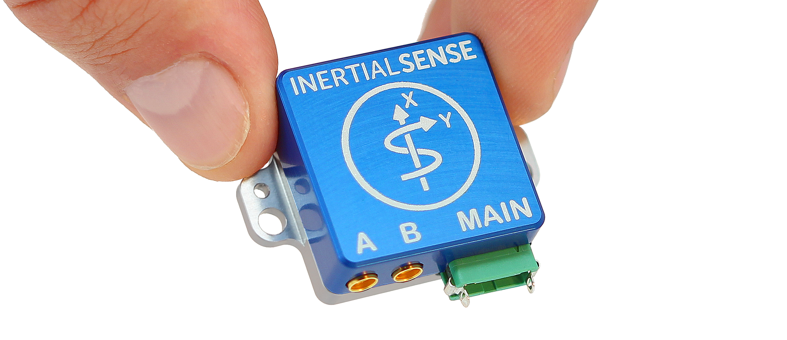

# Rugged-1

The Inertial Sense Rugged-1 is a ruggedized carrier board and case for the Inertial Sense µINS, µAHRS, or µIMU module. The Rugged-1 has similar functions compared to the EVB-1, but in a more compact form factor with the following added features:

## Features

- **Tactical Grade IMU (w/ uINS-5)**

- - **Gyro: 1.5 °/hr Bias Instability, 0.17 °/√hr ARW**
  - **Accel: 20 μg Bias Instability, 0.04 m/s/√hr VRW**
- **High Accuracy INS (w/ uINS-5):  0.05° Roll/Pitch, 0.08° Dynamic Heading**
- Up to 1KHz IMU and INS Output Data Rate
- Dual onboard multi-band (L1/L2/E5) GNSS receivers
- Dual MMCX antenna ports for GPS compassing
- Size:  25.4 x 25.4 x 11.2 mm
- Light weight:  10.5g
- Low power consumption:  <1100mW
- UART x3, RS232, RS485, CAN, and SPI interfaces
- Integrated CAN and RS232 / RS485 transceivers
- Voltage regulation for 3.3V - 17V input

## Applications

- Drone Navigation
- Unmanned Vehicle Payloads
- Ground and Aerial Survey
- Automotive Navigation
- Stabilized Platforms
- Antenna and Camera Pointing
- First Responder and Trackers
- Health, Fitness, and Sport Monitors
- Robotics and Ground Vehicles
- Maritime

## LICENSE

Use these Hardware Design files as you wish.  Inertial Sense is not liable for any claim, damages, or other liability resulting from their use.  See the included *LICENSE* file for details.

------

## Support

Email - support@inertialsense.com

------

(c) 2014-2022 Inertial Sense, Inc.
