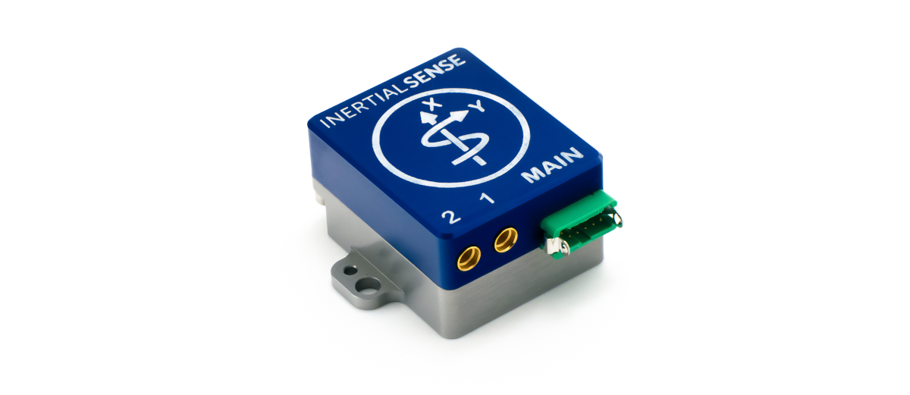

# Rugged-2

The Inertial Sense Rugged-2 is a ruggedized carrier board and case for the Inertial Sense µINS, µAHRS, or µIMU module. The Rugged-2 has similar functions compared to the EVB-1, but in a more compact form factor with the following added features:
- Onboard multi-band GNSS receiver(s) 
- Dual antenna ports for GPS compassing
- Integrated CAN transceiver
- Integrated RS232 / RS485 transceivers

## LICENSE

Use these Hardware Design files as you wish.  Inertial Sense is not liable for any claim, damages, or other liability resulting from their use.  See the included *LICENSE* file for details.

------

## Support

Email - support@inertialsense.com

------

(c) 2014-2022 Inertial Sense, Inc.
