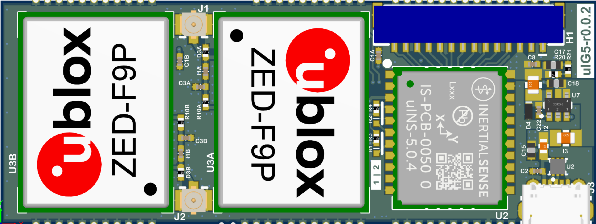

# uIG5

The Inertial Sense uIG5 module combines the uINS and up to two ublox ZED-F9P multi-band GNSS receivers in a compact surface mount modular form factor. 

## Features

- **Tactical Grade IMU (w/ uINS-5)**
  - **Gyro: 1.5 °/hr Bias Instability, 0.17 °/√hr ARW**
  - **Accel: 20 μg Bias Instability, 0.04 m/s/√hr VRW**

- **High Accuracy INS (w/ uINS-5):  0.05° Roll/Pitch, 0.08° Dynamic Heading**
- Up to 1KHz IMU and INS Output Data Rate
- Dual onboard multi-band GNSS receivers. 
- Dual U.FL antenna ports for GPS compassing.
- Small form factor:  65.2 x 24.5 x 5.9 mm
- Light weight:  <15g
- Low power consumption:  <1500mW
- Surface Mount Reflowable.
- Breakout header and micro USB interface to the uINS.
- Onboard voltage regulation for 3.3V - 17V input. 

## Applications

- Drone Navigation
- Unmanned Vehicle Payloads
- Ground and Aerial Survey
- Automotive Navigation
- Stabilized Platforms
- Antenna and Camera Pointing
- First Responder and Trackers
- Health, Fitness, and Sport Monitors
- Robotics and Ground Vehicles
- Maritime

## LICENSE

Use these Hardware Design files as you wish.  Inertial Sense is not liable for any claim, damages, or other liability resulting from their use.  See the included *LICENSE* file for details.

------

## Support

Email - support@inertialsense.com

------

(c) 2014-2022 Inertial Sense, Inc.
