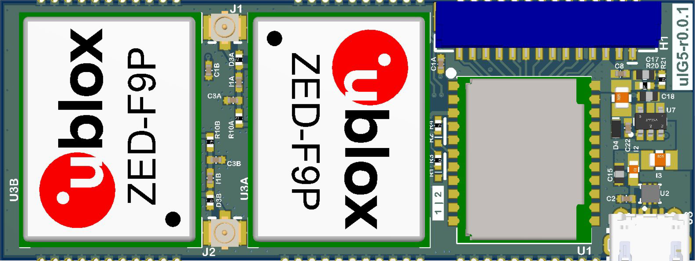

# uIG5

The Inertial Sense uIG5 module combines the uINS and up to two ublox ZED-F9P multi-band GNSS receivers in a compact surface mount formfactor. The uIG5 includes the following features:
- Onboard multi-band GNSS receiver(s) 
- Dual antenna ports for GPS compassing
- Surface mount solder assembly

## LICENSE

Use these Hardware Design files as you wish.  Inertial Sense is not liable for any claim, damages, or other liability resulting from their use.  See the included *LICENSE* file for details.

------

## Support

Email - support@inertialsense.com

------

(c) 2014-2022 Inertial Sense, Inc.
