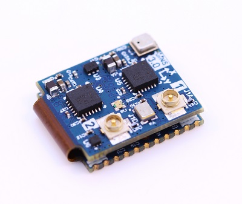

# uINS-3

The Inertial Sense uINS is a miniature calibrated dual GPS aided Inertial Navigation System (GPS-INS) that provides attitude/orientation, velocity, position and robust heading not reliant on magnetometer input.

## Features

- Accuracy INS (w/ IMU-5):  0.1° Roll/Pitch, 0.3° Dynamic Heading
- Up to 1KHz IMU and INS Output Data Rate
- Small Form Factor:  16.3 x 12.6 x 4.6 mm
- Light Weight:  1.3 g
- Low power consumption:  <420mW
- External GNSS Support (Multi-Band)
- Attitude (Roll, Pitch, Yaw, Quaternions), Velocity, and Position UTC Time Synchronized
- Triple Redundant IMUs Calibrated for Bias, Scale Factor, Cross-axis Alignment, and G-sensitivity
- -40°C to 85°C Sensor Temperature Calibration
- Binary and NMEA ASCII Protocol
- Barometric Pressure and Humidity
- UART x3, SPI interfaces
- Strobe In/Out Data Sync (Camera Shutter Event) 
- Fast Integration with SDK and Example Software

## Applications

- Drone Navigation
- Unmanned Vehicle Payloads
- Ground and Aerial Survey
- Automotive Navigation
- Stabilized Platforms
- Antenna and Camera Pointing
- First Responder and Trackers
- Health, Fitness, and Sport Monitors
- Robotics and Ground Vehicles
- Maritime

## LICENSE

Use these Hardware Design files as you wish.  Inertial Sense is not liable for any claim, damages, or other liability resulting from their use.  See the included *LICENSE* file for details.

------

## Support

Email - support@inertialsense.com

------

(c) 2014-2022 Inertial Sense, Inc.
