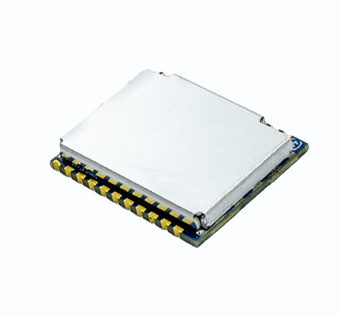

# uINS-5

The Inertial Sense uINS is a miniature calibrated dual external GNSS aided Inertial Navigation System (GNSS-INS) that provides attitude/orientation, velocity, position and robust heading not reliant on magnetometer input.  GNSS receivers are not included onboard.

## LICENSE

Use these Hardware Design files as you wish.  Inertial Sense is not liable for any claim, damages, or other liability resulting from their use.  See the included *LICENSE* file for details.

------

## Support

Email - support@inertialsense.com

------

(c) 2014-2022 Inertial Sense, Inc.
